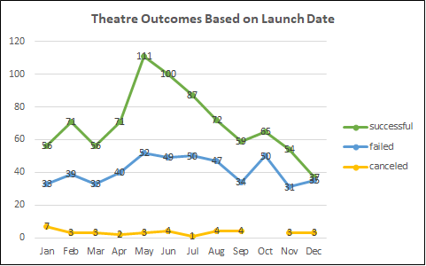
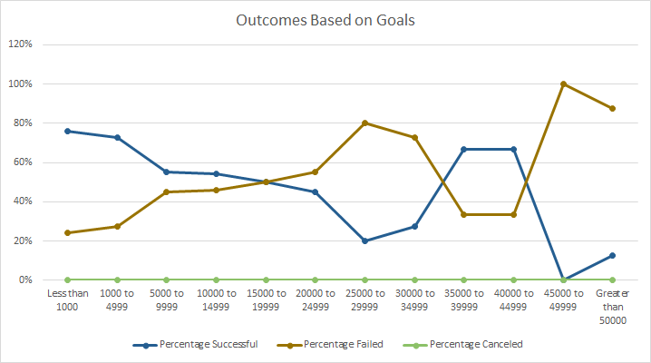

# Kickstarter-analysis
Analysis and visual representation of data from excel files pertaining to kick-starter campaigns.

## Overview of Project
The purpose of this project was to introduce us to, and then execute an intermediate understanding of one of the most essential tools for just about every conventional worker in modern society, Excel.  Having given us an expansive worksheet containing a large pool of data concerning Kick-starter campaigns and the degrees to which they were created, succeeded, and funded it was our task to extrapolate information from the worksheet to visualize certain trends and conclusions about specific sectors of the data.  For instance the two specific criteria we were tasked to isolate were how well campaigns did based on the month of the year in which they were launched and how well theatrical play oriented campaigns did based off how much their target goal amount was.  The entire project required an understanding of compressing daunting amounts of the information given to us in more digestible portions utilizing specific excel functions, pivot tables with corresponding filters, and charts that will then help visualize the compressed data into an optimized and immediate graphic.   

## Analysis and Challenges

### Analysis of Outcomes Based on Launch Date
Utilizing our knowledge of pivot tables and filters we constructed a new sheet off the original data pool give nto us titled Theatre Outcomes by Launch Date where in we compressed the data into an efficiently legible and navigable pivot table that helped interpret what goal outcomes looked like depending of the time of year the campaign would launch but only for campaigns attempting to fund some sort of theatrical play.  From that table we created a chart with vibrant and clear traits to really seal the deal in terms of visualizing the data which is extremely important for potential clients who may or may not be comfortable looknig at raw data but would rather see a basic chart to help understand the trends being represented.  Said chart can be viewed here.

### Analysis of Outcomes Based on Goals
For this sheet within the main excel project we used the same skillsets as before while putting a greater emphasis on the complex functions you can input into excel to optimize how the data is entered and represented.  For instance I would say for this sheet, being able to properly execute the COUNTIFS function was crucial to the success of the assignment as one can see when they look at our columns labeled, projects: successful, canceled, and failed.  Being able to immediately count all data cells in an especially large data set can optimize specific criteria to be seen and analyzed in a heartbeat.  Then with simple sum functions we are able to create a sense of totality for that specific data variable which in this case happened to be the total number of projects for each goal status.  The other functions utilized a knowledge of basic math and how such equations are represented in excel to calculate percentages which in a scenario of presentation, is an extremely digestible and accesible way to present numbers to pretty much anyone in the working world as well as being a good indicator set for the chart we subsequently created which compared the % of successful, failed, and cenceled projects vs. the total amount of money that was preset as the goal of the campaign.  This graph can then easily distinguish which monetary goal points had which % of success and failure etc.  The afforementioned chart can be viewed here.

### Challenges and Difficulties Encountered
The only challenge I encountered for the Outcomes against launch period worksheet was being able to navigate and utilize the filters allocated to the pivot charts, which in the end was not entirely challenging but more rewarding as that process was very intuitive.  The Outcomes against goal amount chart however saw an increased level of difficulty from my perspective as being able to properly input the correct syntax for the COUNTIFS functions consumed much of my time for the project as a whole but, like I mentioned earlier, felt really rewarding after I succeeded in inputting it correctly as it felt complex and puzzle-like and created a wonderfully optimizing effect on the data being represented.

## Results

- What are two conclusions you can draw about the Outcomes based on Launch Date?

As the season reached late spring and into summer there was a noticeable increase in the amount of campaigns being created which leads me to believe that the funding of plays and theatre productions are carried out in the summer in anticipation of an autumnal theatre season of sorts as funding a play on within weeks of it being performed seems illogical.  Another conclusion I noticed was this same period of time from roughly May to August also had the highest discrepency between success and failure with success nearly doubling every month so it seems that that may be another correlating factor in creating summer campaigns in that people are more likely to donate to your cause as the weather improves. 
- What can you conclude about the Outcomes based on Goals?

- What are some limitations of this dataset?

- What are some other possible tables and/or graphs that we could create?
